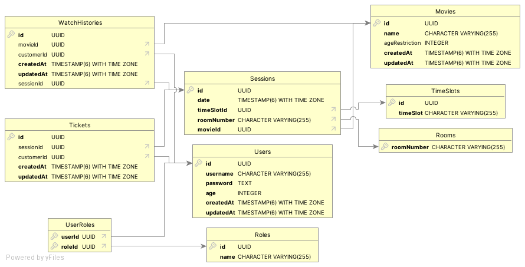

<p align="center">
  <a href="https://creainc.us/" target="blank"></a>
</p>

## Description

Movie Management System Case Study

[About Assignment](AboutAssignment.md)

## Installation

```bash
$ npm install
```

## Configuration

Before running application. Make sure that configuration are set correctly.

Create `.dev.env` file in `root` directory with same keywords as `.env.sample` file for development environment.

Create `.env` file in `root` directory with same keywords as `.env.sample` file for production environment.

Create `config.json` file in `.database/config` directory with same structure as `.database/config/config.sample.json` file for development environment.

Change `NODE_ENV` key in `config.ini` file to `development` or `production` depending on environment selection.

## Running the app

```bash
# development
$ npm run start

# watch mode
$ npm run start:dev

# production mode
$ npm run start:prod
```

## SQL Seeders

```bash
# development environment
$ npm run db:sync:dev

# production environment
$ npm run db:sync:prod
```

## ER Diagram

<p align="center">
  
</p>

## Test

```bash
# unit tests
$ npm run test

# e2e tests
$ npm run test:e2e

# test coverage
$ npm run test:cov
```
